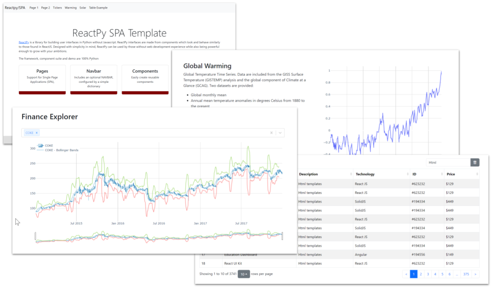

# reactpy-template

Template for [reactpy](https://reactpy.dev/docs/index.html) based multi-page projects.

* FastAPi server based (can easily be changed)
* Page container, custom router
* Tables with search, sort and pagination
* Integration with Plotly charts
* Example of 404 page, global_warming_page, home_page, page_404, ticker_page.

## Usage

    poetry install --no-root
    poetry shell

    python app.py

Visit [http://127.0.0.1:8000/](http://127.0.0.1:8000/)